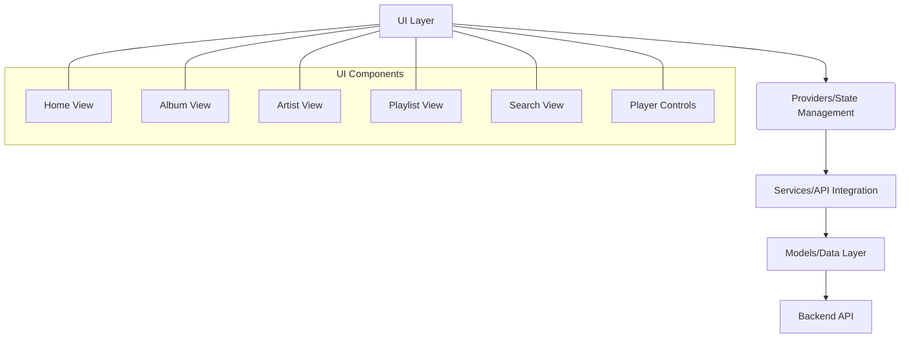
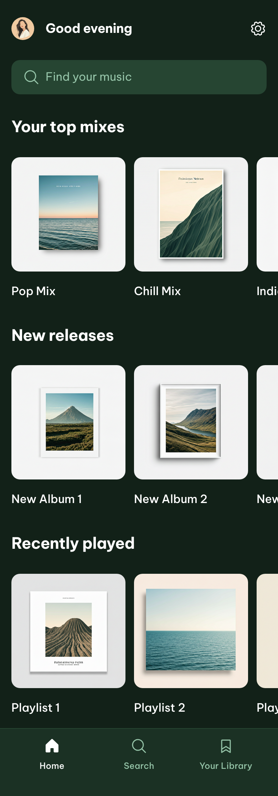
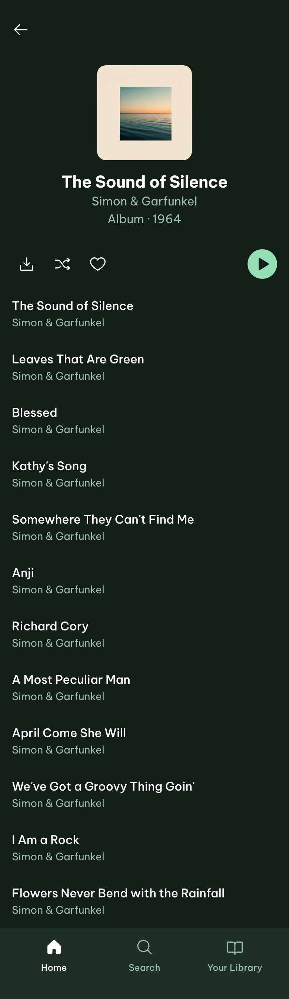
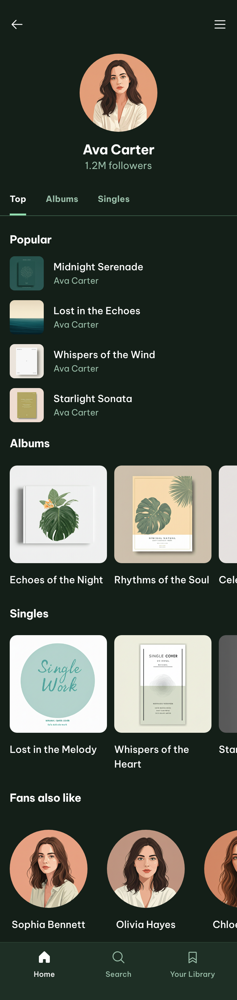
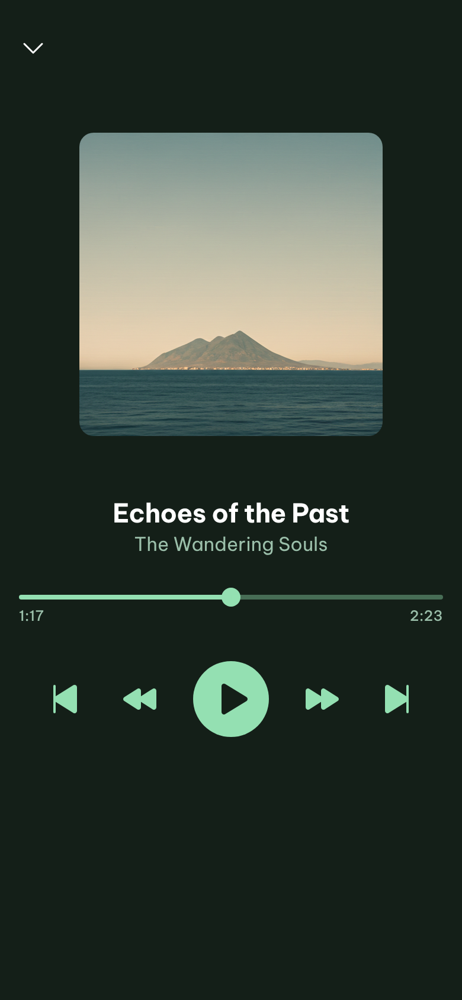
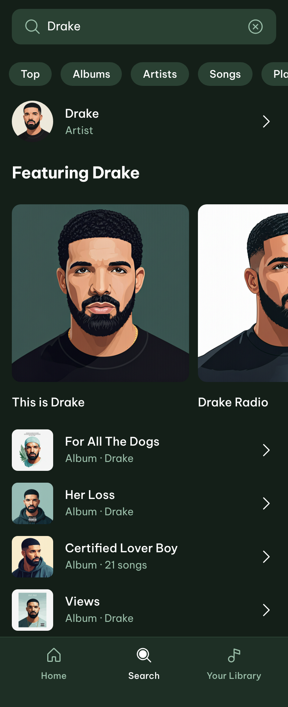

# Flaavn Music App

A comprehensive music streaming application built with Flutter.

## Features

This Flutter project provides a comprehensive music listening experience with the following features:

- **Home Screen:** Discover trending music and new releases.
- **Album View:** Browse and play songs from specific albums.
- **Artist View:** Explore music by your favorite artists.
- **Playlist Management:** Create and manage your personalized playlists.
- **Search Functionality:** Easily find songs, albums, artists, and playlists.
- **Music Playback:** Seamless audio playback experience with player controls.
- **API Integration:** Fetches music data from a backend API.

## Architecture Diagram

## Design

Here are some screenshots showcasing the application's design:

    

## Application Flow

The application's flow is structured around Flutter's widget tree and `go_router` for navigation.

1.  **Entry Point (`main.dart`):** The application starts with `MyApp`, which initializes `GoRouter` to manage navigation. It also sets up `ProviderScope` for state management using Riverpod and applies the defined `MaterialTheme`.
2.  **Routing (`routes.dart`):** This file defines the application's navigation structure using `go_router`.
    *   `FlaavnShellRouteData` acts as a shell for the main application views, providing a consistent `Scaffold` with a `FlaavnPlayBar` (music player controls) and `FlaavnNavigationBar` (bottom navigation) visible across different screens.
    *   Routes like `HomeScreenRoute`, `AlbumRoute`, `PlaylistRoute`, and `SearchScreenRoute` are defined, mapping specific paths to their respective view widgets.
3.  **Views (`lib/views/`):** These are the main screens of the application, such as `home.dart`, `album.dart`, `playlist.dart`, and `search.dart`. They build the UI for each section and interact with providers and services to fetch and display data.
4.  **State Management (`lib/providers/`):** Riverpod is used for state management, with providers like `flaavn_api.dart` and `player.dart` managing application-wide data and logic, such as API calls and music playback state.
5.  **Services (`lib/services/`):** The `flaavn_api_service.dart` handles communication with the backend API, fetching music data.
6.  **Models (`lib/models/`):** This directory contains data models (e.g., `album.dart`, `song.dart`, `playlist.dart`) that define the structure of the data consumed from the API and used throughout the application.
7.  **Widgets (`lib/widgets/`):** Reusable UI components like `FlaavnNavigationBar` and `FlaavnPlayBar` are defined here, promoting modularity and consistency in the user interface.

This architecture ensures a clear separation of concerns, making the application maintainable and scalable.
